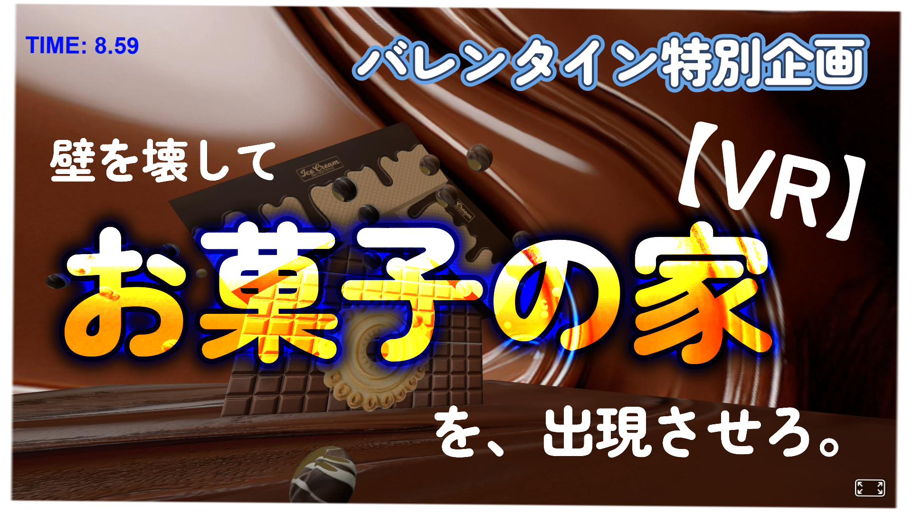

# vr-valentine-2026
【VRゲーム】お菓子の家を目指せ！ | バレンタイン2026🍫

（A-Frameで作成）

# 🍫 制作のきっかけ (Idea)
* 飲食・小売業の販促支援の企画で
* バレンタインデーに向けて
* お菓子の家とかVRで再現出来たら面白いよね

と、思い付いたのがきっかけです。

# 📣 免責事項（Disclaimer）
* アドビストックの素材を使用
* ライセンスの都合上 assets/ 非公開です

## 🎮 遊んでみる・見てみる (Play & Watch)
👉 **[🎮 今すぐブラウザで遊ぶ (Play Demo)](https://portfolio.shibuya-yuki.top/vr/vr-valentine/)**

※ スマホでもPCでも遊べます！

👉 **[🎥 デモプレイ動画を見る (ニコニコ動画) ](https://www.nicovideo.jp/watch/sm45902453)**

## 概要 (Overview)
* タイムアタック🕐
* 画面に現れるチョコボールを投げる🥎
* 何回か投げて箱を壊せ👍
* 美味しそうなお菓子の家が現れるかも！？
* オーソドックスなWASDコントローラー🎮

## 使用技術 (Tech Stack)
* HTML / JavaScript
* A-Frame (WebVRフレームワーク)
* Gemini（ゲーム部分は、ほぼGemini）

## 制作者 (Author)
**渋谷佑生 (Yuki Shibuya)**
* 岩手県で活動する「表現する実務家（行政書士）」
* 音楽配信したり
* 算命学のアプリを配信したり

あまり、行政書士っぽくない活動をしています。
